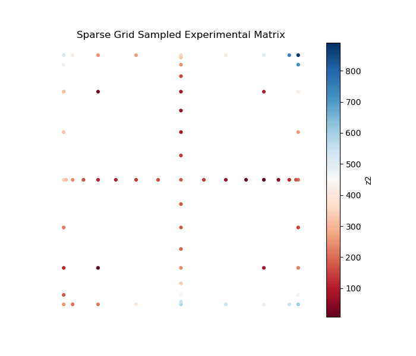
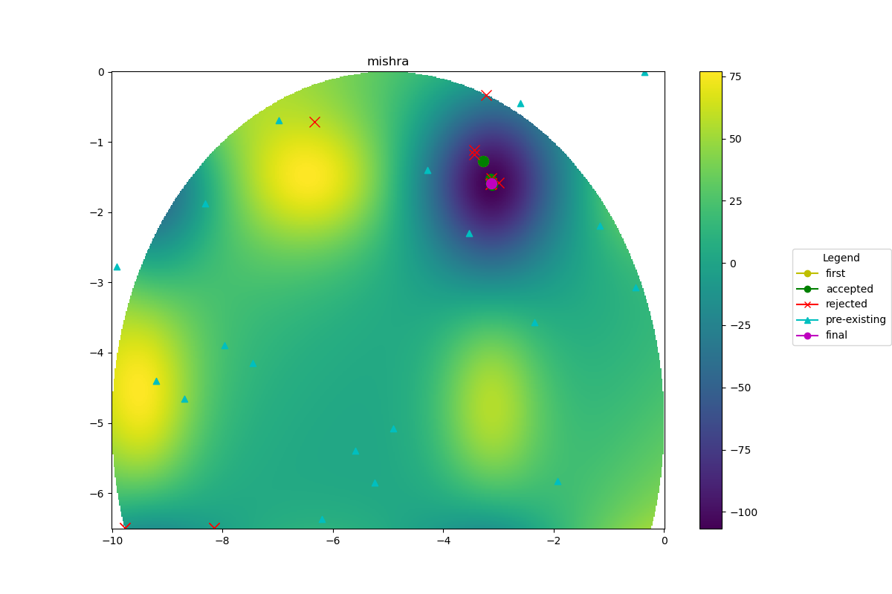
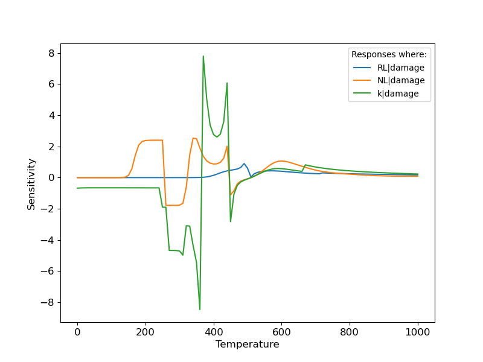

# POEM

**Platform of Optimal Experiment Management**

POEM is a Python package and command line tool for building RAVEN workflows for
optimal experiment management. It translates a compact POEM XML input into a
RAVEN input file, then optionally runs the generated workflow.

POEM uses RAVEN for model exploration and decision support, and supports random
sampling, surrogate model training, sparse-grid experiment design, dynamic
sensitivity analysis, Bayesian optimization, and Bayesian model calibration.

- Documentation: <https://idaholab.github.io/POEM/>
- Source: <https://github.com/idaholab/POEM>
- Package: `poem-ravenframework`
- Command line entry point: `poem`

## Requirements

- Python 3.11
- `uv`
- Runtime dependencies from `pyproject.toml`, including `raven_framework` and
  `baycal-ravenframework`

`pyproject.toml` currently restricts Python to `>=3.11,<3.12` because the
resolved RAVEN/BayCal dependency stack includes packages that do not provide
compatible wheels for Python 3.12 on all supported platforms.

## Installation

Install the released package from PyPI:

```bash
uv venv --python 3.11
source .venv/bin/activate
uv pip install poem-ravenframework
```

Install from source for development:

```bash
git clone git@github.com:idaholab/POEM.git
cd POEM
uv sync --python 3.11
source .venv/bin/activate
```

`uv sync` creates `.venv`, installs POEM in editable mode, and installs the
runtime dependencies declared in `pyproject.toml`.

## Quick Start

Run an example input from a source checkout:

```bash
poem -i tests/lhs_sampling.xml -nr
```

The `-nr` option creates the RAVEN input file without running RAVEN. By default,
POEM writes the generated file next to the input as `raven_<input-file-name>`.
Use `-o` to choose a different output path:

```bash
poem -i tests/lhs_sampling.xml -o tests/raven_lhs_sampling.xml -nr
```

To generate and run the RAVEN workflow, omit `-nr`:

```bash
poem -i tests/lhs_sampling.xml
```

## Input Model

POEM inputs are XML files rooted at `<Simulation>`. The main blocks are:

| Block | Purpose |
| --- | --- |
| `<RunInfo>` | Working directory, batch size, and execution settings. |
| `<GlobalSettings>` | Analysis type, input variables, output variables, limits, and analysis-specific options. |
| `<Distributions>` | RAVEN distributions for input variables. |
| `<Models>` | RAVEN models, commonly external Python models. |
| `<Files>` | Optional model input files. |
| `<Functions>` | Optional external functions, such as Bayesian optimization constraints. |
| `<LikelihoodModel>` | Bayesian calibration likelihood data. |

Minimal LHS input:

```xml
<?xml version="1.0" ?>
<Simulation>
  <RunInfo>
    <WorkingDir>LHS</WorkingDir>
    <batchSize>1</batchSize>
  </RunInfo>

  <GlobalSettings>
    <AnalysisType>LHS</AnalysisType>
    <limit>10</limit>
    <Inputs>x, y</Inputs>
    <Outputs>OutputPlaceHolder</Outputs>
  </GlobalSettings>

  <Distributions>
    <Uniform name="x">
      <lowerBound>-10</lowerBound>
      <upperBound>0</upperBound>
    </Uniform>
    <Uniform name="y">
      <lowerBound>-6.5</lowerBound>
      <upperBound>0</upperBound>
    </Uniform>
  </Distributions>
</Simulation>
```

See [Quick Start](docs/source/quickstart.rst) for the full input structure.

## Supported Analyses

Set the workflow type with `<AnalysisType>` in `<GlobalSettings>`.

| `AnalysisType` | Description | Documentation |
| --- | --- | --- |
| `mc` | Monte Carlo model exploration. | [Monte Carlo](docs/source/mc.rst) |
| `lhs` | Latin Hypercube Sampling for experiment design. | [LHS](docs/source/lhs.rst) |
| `train_rom` | Train Gaussian Process ROMs from data. | [ROM](docs/source/rom.rst) |
| `sparse_grid_construction` | Generate sparse-grid experiment locations. | [Sparse Grid](docs/source/sparsegrid.rst) |
| `sparse_grid_rom` | Train Gaussian Polynomial Chaos ROMs from sparse-grid data. | [ROM](docs/source/rom.rst) |
| `sensitivity` | Static or dynamic sensitivity and uncertainty analysis. | [Sensitivity](docs/source/sen.rst) |
| `bayesian_optimization` | Bayesian optimization using simulation and optional prior data. | [Bayesian Optimization](docs/source/bayesian.rst) |
| `model_calibration` | Bayesian model calibration with experiment data. | [Calibration](docs/source/calibration.rst) |

Many analyses support dynamic models by setting `<dynamic>True</dynamic>` and a
`<pivot>` variable in `<GlobalSettings>`.

## Examples

Representative outputs from the documented workflows:

| Sparse-grid sampling | Bayesian optimization | Sensitivity analysis |
| --- | --- | --- |
|  |  |  |

Additional figures and animations:

- [Pareto frontier scatter plot](docs/pics/plot_pp_scatter-scatter.png)
- [Matyas Bayesian optimization animation](docs/pics/bayopt_matyas.mp4)
- [Mishra Bayesian optimization animation](docs/pics/bayopt_mishra.mp4)
- [Bayesian model calibration example](docs/pics/model_calibration.png)

Example inputs are available under:

- `tests/`
- `workflow/`
- `use_cases/`

## Documentation

Build the HTML documentation locally:

```bash
uv sync --python 3.11 --extra docs
source .venv/bin/activate
cd docs
make html
cd build/html
python3 -m http.server
```

Open <http://localhost:8000> in your browser.

## Project Layout

| Path | Description |
| --- | --- |
| `src/main.py` | CLI entry point used by the `poem` command. |
| `src/poem/PoemTemplateInterface.py` | Parses POEM XML and builds RAVEN workflow blocks. |
| `src/poem/PoemTemplate.py` | Loads, modifies, writes, and optionally runs RAVEN templates. |
| `src/poem/templates/` | RAVEN XML templates selected by `AnalysisType`. |
| `models/` | Example external models. |
| `tests/` | Example POEM and generated RAVEN inputs. |
| `docs/source/` | Sphinx documentation source. |
| `docs/pics/` | Documentation and README figures. |

## Development Checks

Useful local checks:

```bash
uv sync --python 3.11 --extra docs
source .venv/bin/activate
poem -i tests/lhs_sampling.xml -nr
cd docs
make html
```

Full workflow execution requires a working RAVEN installation and any external
model dependencies required by the selected input.

## Contributing

Contributions are welcome. Open an issue for bugs or feature requests, and submit
pull requests against the development branch used by the project.

## License

See [LICENSE](LICENSE) and [NOTICE.txt](NOTICE.txt).
