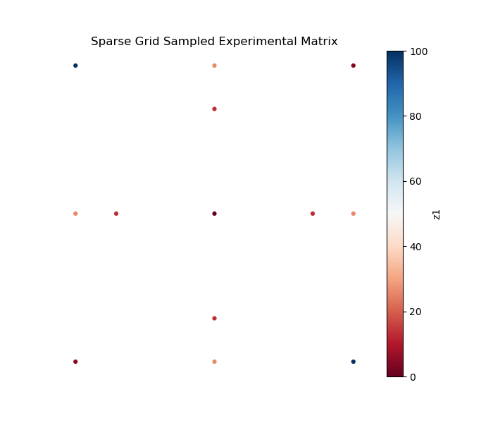
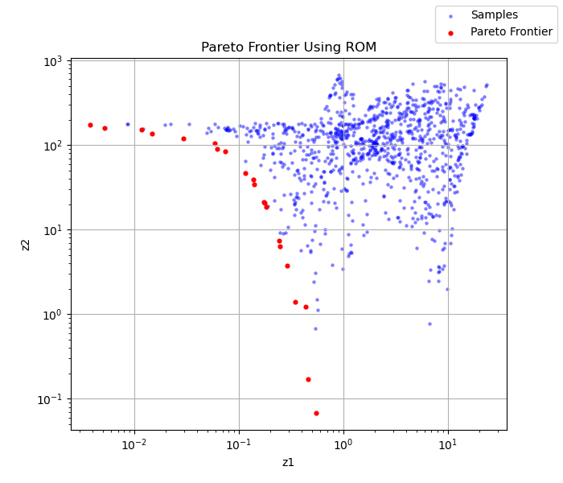
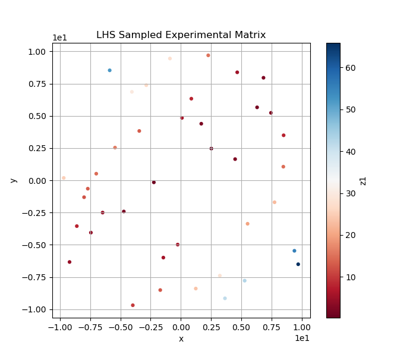
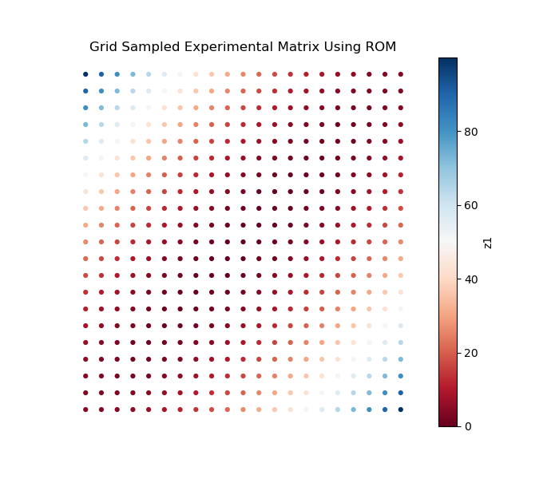
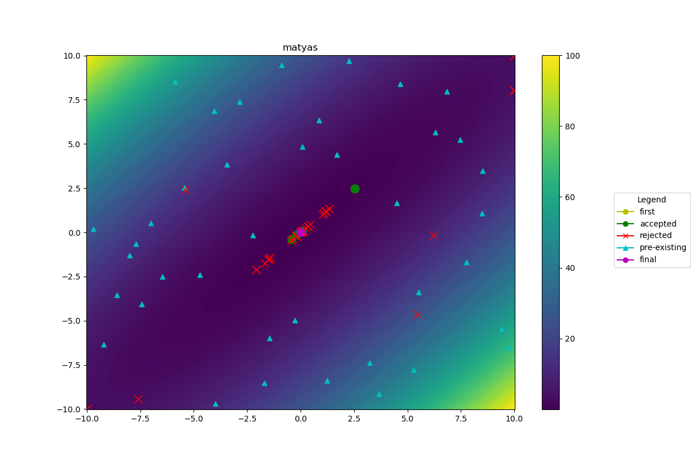
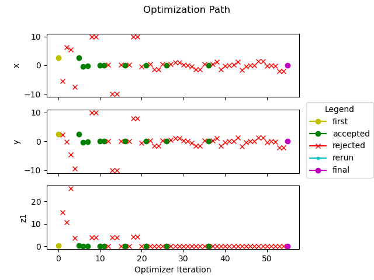
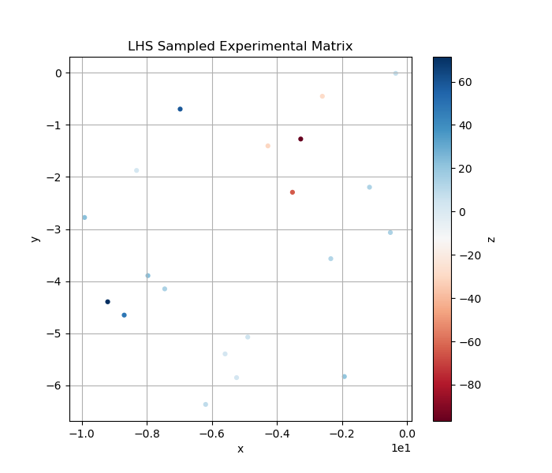
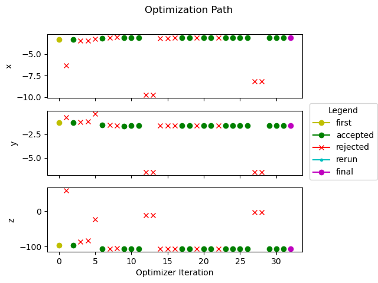
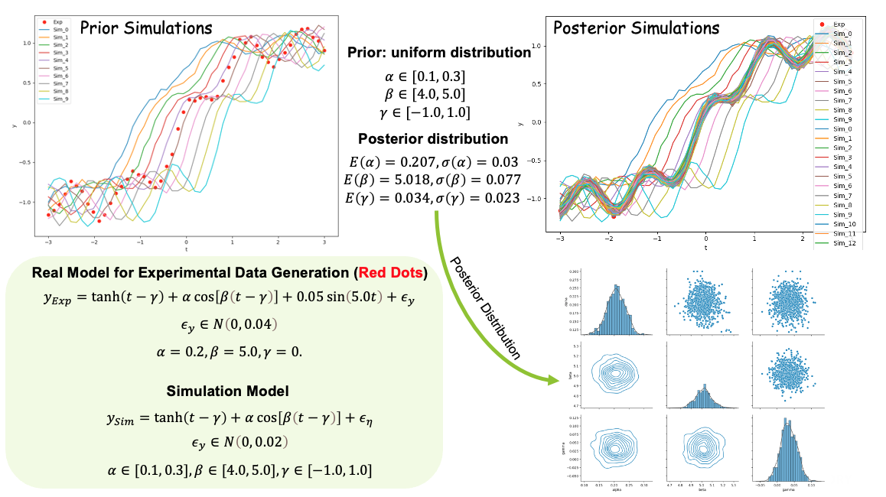

# POEM
## Platform of Optimal Experiment Management (POEM)

An optimal experimental design platform powered with automated machine learning to automatically guides the design of experiment to be evaluated. This tool generates RAVEN (https://github.com/idaholab/raven) input files. More information can be found at https://idaholab.github.io/POEM/

## How to build html?

```bash
  pip install sphinx sphinx_rtd_theme nbsphinx sphinx-copybutton sphinx-autoapi
  conda install pandoc
  cd doc
  make html
  cd build/html
  python3 -m http.server
```

open your brower to: http://localhost:8000

## Installation

```
conda create -n poem_libs python=3.10
conda activate poem_libs
pip install poem-ravenframework
```

## Git Clone Repository

```
git clone git@github.com:idaholab/POEM.git
```

## Source Installation (Linux/macOS)

When installing from source in plugin layout, create a local `POEM` symlink before editable install:

```bash
ln -s ../POEM .
pip install -e .
```

Keep the `POEM` symlink (`POEM -> ../POEM`) in the repository root while using `poem` from a source editable install.
Do not commit this symlink to git.

Note: this workaround is for Linux/macOS and is not supported on Windows.

## Test

```
cd POEM/tests
poem -i lhs_sampling.xml
```
or test without run
```
poem -i lhs_sampling.xml -nr
```
or
```
poem -i lhs_sampling.xml --norun
```

## Capabilities

- Material thermal property modeling
- Design parameter optimization with multiple objectives
- Determining where to obtain new data in order to build accurate surrogate model
- Dynamic sensitivity and uncertainty analysis
- Model calibration through Bayesian inference
- Data adjustment through generalized linear least square method
- Machine learning aided parameter space exploration
- Bayesian optimization for optimal experimental design
- Pareto Frontier to guide the design of experiment to be evaluated
- Sparse grid stochastic collocation to accelerate experimental design


## Accelerate Experimental Design via Sparse Grid Stochastic Collocation Method

### Matyas Function



### Himmelblau's Function


### Pareto Frontier




## Accelerate Experimental Design via Bayesian Optimization Method

### Matyas Function
- LHS pre-samplings to simulate experiments

- Train Gaussian Process model with LHS samples, and use Grid approach to sample the trained Gaussian Process model

- Utilize Bayesian Optimization with pre-trained Gaussian Process model to optimize the experimental design

<div align="center">
  <br><br>
  <br><br>
</div>

[Bayesian optimization animation for the Matyas function](docs/pics/bayopt_matyas.mp4)

### Mishra

Bird Constrained Function

- LHS pre-samplings to simulate experiments

- Train Gaussian Process model with LHS samples, and use Grid approach to sample the trained Gaussian Process model

- Utilize Bayesian Optimization with pre-trained Gaussian Process model to optimize the experimental design

<div align="center">
  <br><br>
  <br><br>
</div>

[Bayesian optimization animation for the Mishra bird constrained function](docs/pics/bayopt_mishra.mp4)

## Dynamic Sensitivity Analysis

- Regression based method
- Sobol index based method


## Bayesian Model Calibration

### Analytic High-Dimensional Problem
A python analytic problem with 50 responses, three input parameters with uniform prior distributions.


